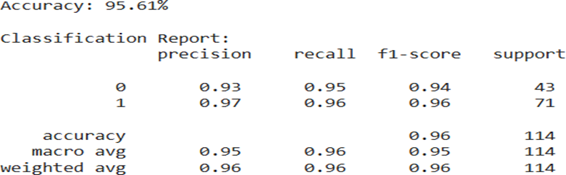

# Practical 3 - SVM Classifier on Breast Cancer Dataset

This practical demonstrates how to implement a Support Vector Machine (SVM) classifier using the `sklearn` library.

---

## 📊 Dataset

- **Dataset Used**: Breast Cancer dataset from `sklearn.datasets`
- **Samples**: 569 instances
- **Features**: 30 numeric features

---

## 🔧 Technologies Used

- Python
- scikit-learn
- Jupyter Notebook

---

## 🧠 Steps Involved

1. **Import Libraries**: `sklearn.datasets`, `SVC`, etc.
2. **Load Dataset**: Load Breast Cancer dataset using `datasets.load_breast_cancer()`
3. **Split Data**: Training (80%) and Testing (20%) using `train_test_split()`
4. **Standardize Data**: Use `StandardScaler()` to scale features
5. **Train SVM Model**: Use `SVC(kernel='linear')`
6. **Predict & Evaluate**: Use `accuracy_score()` and `classification_report()`

---

## 📈 Sample Output

